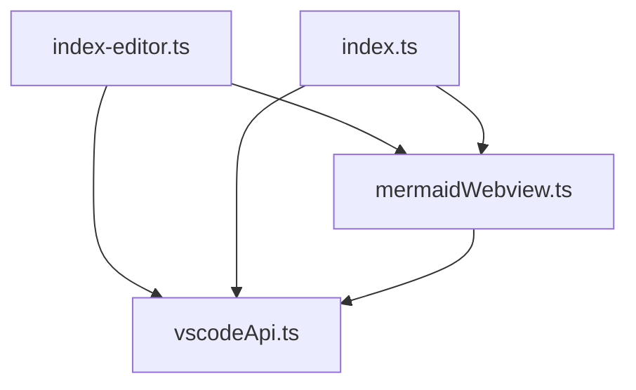

# 🛡️ Sentinel Report: 2/15/2026 3:33:11 PM

**Stability**: Toxic
**Entropy**: 35 (✅ Monotonic)
**Ratchet**: 🔓 OPEN

## 📊 Metrics
- **Zoning Law**: 0 violations
- **Cyclic Rot**: 0 cycles
- **Duplication**: 3 instances
- **Toxicity**: 0 hotspots

## 🗺️ Visual Architecture

## 📜 High-Priority Alerts

- 👯 [Semantic Duplicate] src/domain/DomainEntity.ts matches .marie-joy-test/src/domain/DomainEntity.ts
- 👯 [Semantic Duplicate] src/infrastructure/BaseAdapter.ts matches .marie-joy-test/src/infrastructure/BaseAdapter.ts
- 👯 [Semantic Duplicate] src/plumbing/BaseTool.ts matches .marie-joy-test/src/plumbing/BaseTool.ts

---
*Marie Sentinel v3.1 — Grounded Architectural Guardian*
